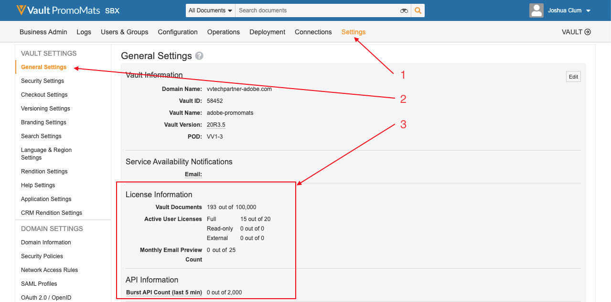

# Bonnes pratiques, garde-fous et avis

## Versions

Cette intégration requiert les versions logicielles minimales suivantes :

* Adobe Experience Manager, 6.5.5+
* Veeva Vault PromoMats, 20R3.2+

## Confidentialité des données

Cette intégration est conçue pour transférer du contenu entre Adobe Experience Manager et Veeva Vault PromoMats. En tant que contrôleur des données, votre entreprise est responsable du respect des lois et réglementations relatives à la confidentialité applicables à votre collecte et à votre utilisation des données.

## Fréquence de synchronisation du contenu

AEM contenu et métadonnées sont synchronisés d’AEM vers VVPN lorsque le workflow d’intégration a été déclenché. Cela peut être effectué automatiquement ou manuellement. Les métadonnées VVPM sont synchronisées de VVPM à AEM. Cela peut être effectué automatiquement par le biais d’un planificateur ou manuellement par le biais d’un clic sur un bouton.

## Limites de l’intégration et bonnes pratiques et protections

Tenez compte des restrictions suivantes lors de l’utilisation de cette intégration :

* Seuls les types de données suivants sont pris en charge lors de la synchronisation de métadonnées : &quot;Texte&quot; et &quot;Texte multiligne&quot;.
* Bien que l’intégration prenne en charge AEM contenu modulaire (fragments de contenu et fragments d’expérience), elle ne prend pas en charge le contenu modulaire VVPM.
* Les documents liés VPM ne sont pas pris en charge.
* La synchronisation des annotations visuelles VPM de VVPM vers AEM n’est pas prise en charge.
* L’intégration n’importe pas de contenu de VVPM vers AEM.
* La validation des métadonnées n’est pas prise en charge.
* Le nombre de documents est limité en fonction de la licence Veeva. Voir [Limites de licence](#veeva-license-limitations).
* Le nombre d’appels API est limité en fonction de la licence Veeva. Pour plus d’informations, voir [Limites de l’API](https://developer.veevavault.com/docs/#what-are-rate-limits). Voir [Limites de licence](#veeva-license-limitations).

## Limites de la licence Veeva

Vous pouvez surveiller les limites de votre instance en accédant aux paramètres généraux du VPM.

