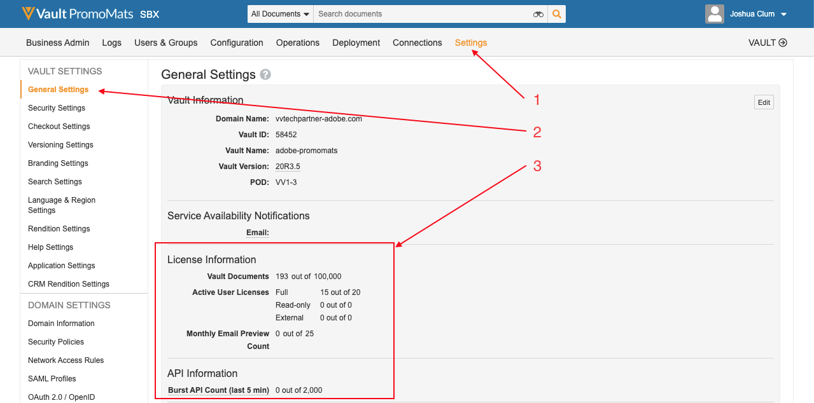

# Bonnes pratiques, mécanismes de sécurisation et avis

## Versions

Cette intégration nécessite les versions logicielles minimales suivantes :

* Adobe Experience Manager, 6.5.5+
* Veeva Vault PromoMats, 20R3.2+

## Confidentialité des données

Cette intégration est conçue pour transférer du contenu entre Adobe Experience Manager et Veeva Vault PromoMats. En tant que contrôleur de données, votre entreprise est tenue de se conformer aux lois et réglementations en matière de confidentialité applicables à votre collecte et à votre utilisation des données.

## Fréquence de synchronisation du contenu

Le contenu et les métadonnées d’AEM sont synchronisés d’AEM vers VVPN lorsque le workflow d’intégration a été déclenché. Cette opération peut être effectuée automatiquement ou manuellement. Les métadonnées VPM sont synchronisées de VPM vers AEM. Cette opération peut être effectuée automatiquement par le biais d’un planificateur ou manuellement par le biais d’un clic sur un bouton.

## Restrictions, bonnes pratiques et mécanismes de sécurisation de l’intégration

Tenez compte des restrictions suivantes lors de l’utilisation de cette intégration :

* Seuls les types de données suivants sont pris en charge lors de la synchronisation des métadonnées : « Texte » et « Texte multiligne ».
* Bien que l’intégration prenne en charge le contenu modulaire AEM (fragments de contenu et fragments d’expérience), elle ne prend pas en charge le contenu modulaire VPM.
* Les documents liés VPM ne sont pas pris en charge.
* La synchronisation des annotations visuelles VPM de VPM vers AEM n&#39;est pas prise en charge.
* L&#39;intégration n&#39;importe pas le contenu de VPM vers AEM.
* La validation des métadonnées n’est pas prise en charge.
* Le nombre de documents est limité en fonction de la licence Veeva. Voir [Limites de licence](#veeva-license-limitations).
* Le nombre d’appels API est limité en fonction de la licence Veeva. Pour plus d’informations, voir [Limites de l’API](https://developer.veevavault.com/docs/#what-are-rate-limits). Voir [Limites de licence](#veeva-license-limitations).

## Limites de licence Veeva

Vous pouvez surveiller les limites de votre instance en accédant aux paramètres généraux du VPM.

