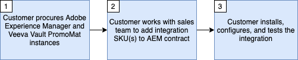

# Prise en main de l&#39;intégration de Veeva Vault PromoMats et Adobe Experience Manager

Cette intégration permet de gérer le contenu, d’appliquer les droits et la conformité tout en tirant parti d’une diffusion d’expérience inégalée.

Cette intégration nécessite les versions logicielles minimales suivantes :

* Adobe Experience Manager, 6.5.5+
* Veeva Vault PromoMats, 20R3.2+

>[!NOTE]
>
>Les utilisateurs du service et les autorisations appropriées sont requis dans les deux systèmes pour l’intégration.
>

>[!IMPORTANT]
>
>Cette fonctionnalité ne fait pas partie des paramètres d’usine du produit. La mise en œuvre nécessite un contrat de maintenance Adobe Consulting. Contactez votre représentant ou représentante Adobe pour en savoir plus.
>

## Principes et fonctionnalités

Cette intégration est conçue pour prendre en charge deux cas d’utilisation principaux :

1. Approbation de contenu : lorsque du nouveau contenu a été créé ou que du contenu existant a été modifié dans AEM, le contenu doit être approuvé pour une utilisation dans le VVPM prenant en charge le processus d’approbation médicale, juridique et réglementaire (MLR) pour les sciences de la vie.
1. Gestion de contenu - Assurez la visibilité de l’utilisation des ressources en établissant des relations dans PromoMats entre les tactiques numériques (par exemple, les e-mails, les présentations, les sites web) et leurs éléments (par exemple, les logos, les photos, les graphiques) créés dans AEM pour les documents provenant d’AEM.

Les avantages sont les suivants :

* Gestion d’une source unique de vérité pour les ressources et le contenu sans duplication sur les référentiels numériques.
* Utilisation de Veeva Vault pour la gestion des droits et de la conformité et d’AEM pour une création/diffusion de contenu et de ressources de premier plan.
* Automatisation du déplacement du contenu et des métadonnées entre AEM et Veeva Vault.
* Réduit les efforts manuels lors de l’envoi de contenu à Veeva pour les workflows d’approbation.
* Chaque système est utilisé pour ses points forts et le connecteur permet de déplacer automatiquement le contenu entre les systèmes afin d’accélérer la mise sur le marché.

À quoi sert l’intégration ?

* Prend en charge l’envoi de pages de site AEM, d’Assets, de fragments de contenu et de fragments d’expérience à VPM. Les pages, fragments de contenu et fragments d’expérience AEM peuvent être envoyés en tant que PDF de capture d’écran ou images. Les fichiers binaires AEM Assets sont envoyés tels quels.
* Prend en charge la synchronisation manuelle et automatisée de certains éléments de métadonnées configurables d’AEM vers VPM.
* Prend en charge la synchronisation manuelle et automatisée de certains éléments de métadonnées configurables depuis VPM vers AEM.
* Prend en charge les relations entre les pages de site AEM, Assets, les fragments de contenu et les fragments d’expérience dans VPM afin d’automatiser les relations de contenu.
* Prend en charge la génération de rendu pour plusieurs types d’appareils.

>[!NOTE]
>
>Consultez la documentation sur l’utilisation de l’intégration pour plus d’informations sur les options de configuration.
>

Que fait le connecteur NOT ?

* Ne reproduit pas les processus et fonctionnalités d’AEM dans Veeva et inversement.
* Ne fait pas le MLR par lui-même. Cela permet d’automatiser l’envoi de contenu à Veeva vers l’emplacement où MLR se produit.
* Ne vise pas à créer une configuration identique entre AEM et Veeva. Tout le contenu ne doit pas nécessairement passer d’une plateforme à l’autre.

>[!IMPORTANT]
>
>Cette intégration considère actuellement AEM comme la source de vérité pour la synchronisation de contenu.

## Obtention de l’intégration

Pour configurer cette intégration, vous devez suivre les étapes ci-dessous.

Consultez le diagramme de flux et les détails du diagramme de flux ci-dessous pour demander et configurer l’intégration.

Détails du diagramme de flux (correspond aux étapes ci-dessus) :

* **Étape 1** - On suppose que vous possédez déjà, ou que vous êtes en train de vous procurer, une licence pour Veeva Vault PromoMats et pour Adobe Experience Manager.
* **Étape 2** - Une nouvelle commande client qui décrit un accord de maintenance avec Adobe Consulting devra être signée pour tirer parti de l’intégration.
* **Étape 3** - Installez, activez et configurez le package d’intégration.

## Assistance

La section suivante décrit comment contacter l’équipe d’assistance et signaler un problème.

### Demande d’intégration ou de prise en charge de Adobe Experience Manager

Des tickets d’assistance peuvent être consignés auprès de l’assistance clientèle Adobe. Votre administrateur Adobe Experience Cloud devra se connecter à [Adobe Admin Console](https://adminconsole.adobe.com/), cliquer sur l&#39;onglet support et créer un dossier. Pour tout problème lié à l’intégration, veillez à inclure les informations suivantes :

* **Titre du processus** : `AEM - Veeva Vault Integration`
* **Propriétaire du processus** : `Data Engineering`
* **Description** : `Description of the issue`
* **Point de contact** : `The email address(es) for relavant AEM point of contacts for your organization.`
* **URL de l’instance AEM** : `Place the Adobe Experience Manager instance url here.`
* **URL de l&#39;instance Veeva** : `Place the Veeva Vault PromoMats instance url here.`

### Demande de prise en charge de Veeva Vault PromoMats

Parfois, le problème rencontré est un problème lié au fonctionnement de l’instance Veeva Vault PromoMats. Si tel est le cas, votre administrateur Veeva Vault PromoMats peut être invité à créer un ticket d&#39;assistance auprès de [Assistance Veeva](http://support.veeva.com/). Vous pouvez consulter l’état de l’instance Veeva en accédant à [Veeva Trust](http://trust.veeva.com/).

