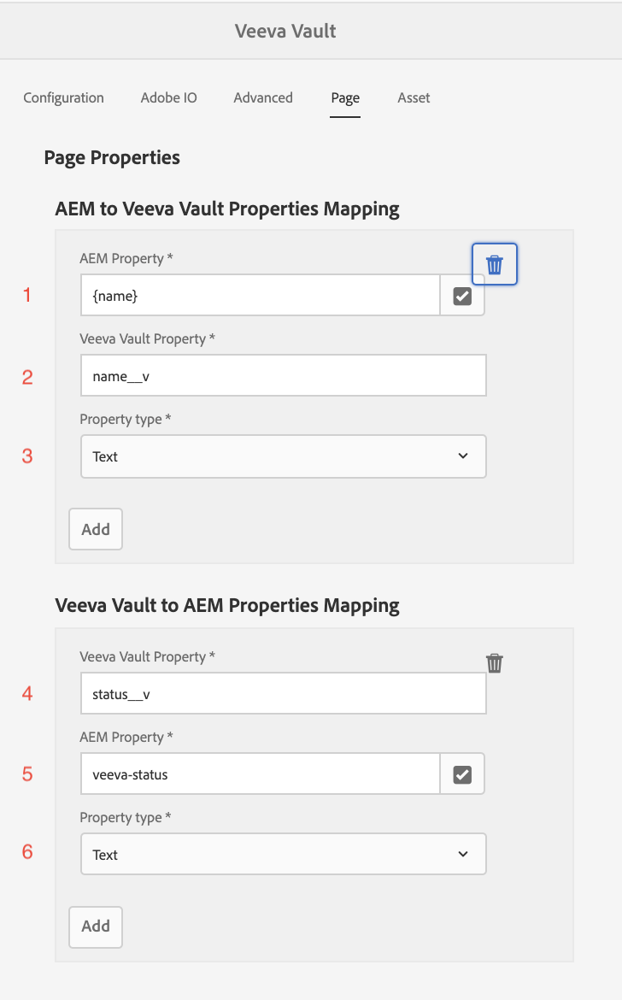
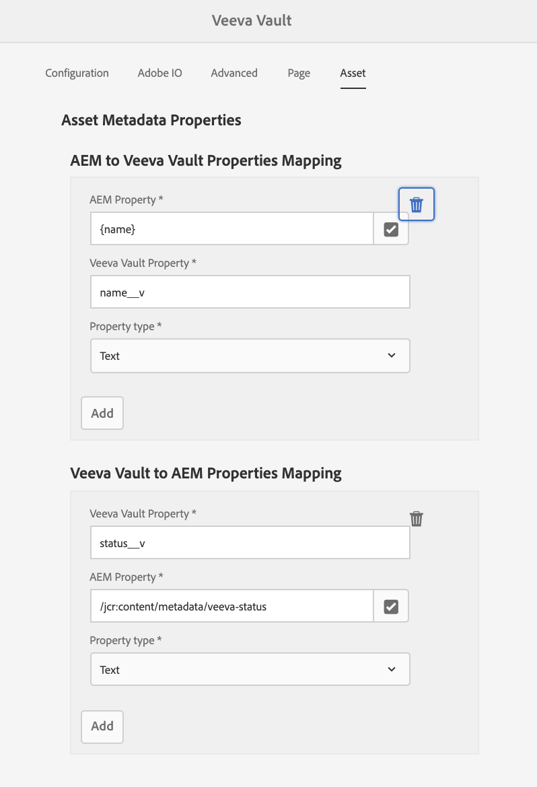

# Utilisation de l’intégration

## Présentation

La présentation vidéo suivante décrit l’utilisation du connecteur :

>[!VIDEO](https://video.tv.adobe.com/v/332137/?quality=12&learn=on)

## Configuration

Ce guide vous guidera tout au long des étapes nécessaires pour mettre en service le connecteur.

>[!IMPORTANT]
>
>Pour chaque système, ces étapes doivent être exécutées par un **administrateur** pour chaque système.
>
>Les étapes de cette documentation vous guideront tout au long de la création d’intégrations/inscriptions impliquant l’attribution d’autorisations et/ou d’accès administrateur.  Il vous incombe de vous assurer que ces étapes sont conformes aux politiques de votre entreprise avant de les exécuter et de les exécuter avec précaution.
>

### Installation du module d’intégration

Vous aurez accès au package d’AEM d’intégration. Il existe deux options pour installer l’intégration :

1. **Installation du package** - Directement en avant et moins impliqué.
2. **Installation POM** - Plus avancée, mais peut être utile lors de l’utilisation d’AEM Cloud Manager et de la mise à niveau de l’intégration.

#### Installation du package

Pour installer le package, téléchargez-le avec le lien fourni dans l’e-mail d’intégration. [Vous trouverez des instructions détaillées sur l’installation d’un package AEM en cliquant ici.](https://experienceleague.adobe.com/docs/experience-manager-64/administering/contentmanagement/package-manager.html?lang=fr&#installing-packages)

#### Installation POM

Pour inclure le connecteur dans votre POM, procédez comme suit. Remplacez votre nom d’utilisateur et votre mot de passe par ceux reçus dans le courrier électronique d’intégration.

1. Ajoutez le code suivant au fichier `.cloudmanager/maven/settings.xml` de votre projet ou `~/.m2/settings.xml` sur votre ordinateur. Remplacez `YOUR_USERNAME` par le nom d’utilisateur et `YOUR_PASSWORD` par le mot de passe fourni dans l’e-mail d’intégration.

   >[!IMPORTANT]
   >
   >Si vous utilisez le gestionnaire de cloud, l’approche sécurisée consiste à suivre les étapes décrites ici pour les [référentiels Maven protégés par mot de passe](https://experienceleague.adobe.com/docs/experience-manager-cloud-service/onboarding/getting-access/create-application-project/setting-up-project.html?lang=fr#password-protected-maven-repositories).
   >

   ```
   <settings>
       ...
       <servers>
           ...
           <server>
               <id>repo.ea.adobe.net</id>
               <username>YOUR_USERNAME</username>
               <password>YOUR_PASSWORD</password>
               <filePermissions>BucketOwnerFullControl</filePermissions>
               <configuration>
                 <wagonProvider>s3</wagonProvider>
               </configuration>
           </server>
           ...
       </servers>
       ...
   </settings>
   ```

2. Ajoutez le code suivant au fichier `pom.xml` du projet :

   ```
   <project>
       ...
       <build>
           ...
           <extensions>
               ...
               <extension>
                   <groupId>com.allogy.maven.wagon</groupId>
                   <artifactId>maven-s3-wagon</artifactId>
                   <version>1.2.0</version>
               </extension>
               ...
           </extensions>
           ...
       </build>
       ...
       <repositories>
           ...
           <repository>
               <id>repo.ea.adobe.net</id>
               <url>s3://repo.ea.adobe.net/release</url>
               <releases>
                   <enabled>true</enabled>
               </releases>
           </repository>
           ...
       </repositories>
       ...
   </project>
   ```

3. Ajoutez le code suivant au fichier `all/pom.xml` du projet. Remplacez `project.dependencies.dependency.version` par la version appropriée et `project.build.plugins.plugin.configuration.embeddeds.embedded.target` par le chemin correct.

   ```
   <project>
       ...
       <build>
           ...
           <plugins>
               ...
               <plugin>
                   <groupId>org.apache.jackrabbit</groupId>
                   <artifactId>filevault-package-maven-plugin</artifactId>
                   ...
                   <configuration>
                       ...
                       <embeddeds>
                           ...
                           <embedded>
                               <groupId>com.adobe.acs.aemveeva</groupId>
                               <artifactId>aem-veeva-connector.all</artifactId>
                               <type>zip</type>
                               <target>/apps/APP_NAME-packages/application/install</target>
                           </embedded>
                           ...
                       </embeddeds>
                   </configuration>
               </plugin>
               ...
           </plugins>
           ...
       </build>
       ...
       <dependencies>
           ...
           <dependency>
               <groupId>com.adobe.acs.aemveeva</groupId>
               <artifactId>aem-veeva-connector.all</artifactId>
               <version>1.0.5</version>
               <type>zip</type>
           </dependency>            
           ...
       </dependencies>
       ...
   </project>
   ```

### Configuration du cloud

Cette intégration est configurée en créant une configuration cloud sur le dossier sur lequel le connecteur sera opérationnel. Pour créer une configuration cloud, procédez comme suit :

1. Accédez à la configuration cloud de Veeva.

   

2. Créez une nouvelle configuration de cloud Veeva sur le dossier approprié et renseignez le comme décrit dans les sections suivantes.

   

#### Onglet Configuration

Renseignez les informations suivantes dans l’onglet de configuration :


1. Requis. Titre de la configuration du connecteur Veeva Vault. Il peut s’agir d’une valeur arbitraire. (par exemple, `Veeva Vault Configuration`)
2. Requis. URL du domaine de l’instance Veeva (par exemple, `https://my-instance.veevavault.com/`)
3. Requis. ID client requis pour appeler l’API Veeva Vault. Il peut s’agir d’une valeur arbitraire qui est principalement utilisée pour le débogage. (par exemple, `adobe-aem-vvtechpartner`)
4. Requis. Nom d’utilisateur de Veeva Vault. Voir [Création d’utilisateurs Veeva](#veeva-user-creation).
5. Requis. Mot de passe de Veeva Vault. Voir [Création d’utilisateurs Veeva](#veeva-user-creation).

#### Onglet Adobe E/S

Si le projet doit générer des PDF ou des images pour les pages, cet onglet est obligatoire. Renseignez les champs suivants dans l’onglet adobe io :


1. Requis. Point de terminaison d’Adobe IO pour la création d’images de PDF fournies dans le courrier électronique d’intégration. (par exemple, `https://my-namespace.adobeioruntime.net/api/v1/web/aem-veeva-serverless-0.0.2/trigger-action.json`)
2. Requis. Nom de l’action pour la génération d’image de page. Cette valeur doit être `aem-veeva-integration/get-image-async`.
3. Requis. Nom de l’action pour la génération d’images HTML. Cette valeur doit être `aem-veeva-integration/get-pdf-async-new`.
4. Requis. Le point d’entrée E/S d’Adobe pour obtenir l’état de la génération fourni dans l’e-mail d’intégration.(par exemple, `https://my-namespace.adobeioruntime.net/api/v1/web/aem-veeva-serverless-0.0.2/get-state-value`)
5. Requis. AEM nom d’utilisateur à utiliser par Adobe IO. Voir [Création d’AEM utilisateur](#aem-user-creation).
6. Requis. AEM mot de passe à utiliser par Adobe IO. Voir [Création d’AEM utilisateur](#aem-user-creation).
7. Facultatif. Le délai d’expiration par défaut permet à la page de répondre jusqu’à un délai spécifié, au-delà duquel le service AIO cesse de tenter d’obtenir une réponse. La valeur par défaut est `30000`.
8. Facultatif. Le délai est une fois que la page a répondu par 200 au délai du rendu de toutes les images avant de prendre une capture d’écran. La valeur par défaut est `2000`.
9. Facultatif. L’URL générée par une capture d’écran/le PDF expire après la valeur configurée en secondes.
10. Facultatif. Le service de génération de PDF/capture d’écran d’Adobe IO est asynchrone. AEM service appelle le point de terminaison d’état AIO pour obtenir une capture d’écran/PDF. Cette propriété décide en millisecondes de la pause entre dans chaque appel d’état. La valeur par défaut est `10000`.
11. Facultatif. Nombre maximal de reprises pour l’appel d’état à Adobe IO pour obtenir une capture d’écran/PDF. La valeur par défaut est `10`.

#### Onglet Avancé

Renseignez les éléments suivants dans l’onglet avancé :


1. Requis pour la génération de PDF/image. Modèle de nom de fichier utilisé lors de la création de PDF/images. `{name}` peut être modélisé. (par exemple, `{name}-screenshot`)
2. Facultatif. Types d’appareils pour lesquels des captures d’écran de page sont requises autres que Bureau. Les types valides sont `Tab (iPad)` et `Mobile (iPhone X)`.
3. Facultatif. Valeur de type de rendu dans Veeva représentant au-dessus du rendu. (par exemple, `web_ready__c`)
4. Requis pour la génération de PDF/image. Type de capture d’écran à créer. `PDF` ou `Image`.
5. Requis pour la génération de PDF/image. Type de PDF à générer. `Print CSS Based PDF` ou `Pixel Perfect Screenshot PDF`.
6. Requis pour la génération de PDF/image. Type d’image à générer. `PNG` ou `JPEG`.
7. Requis. Workflow à exécuter une fois que le déclencheur d’approbation Veeva Vault est arrivé.
8. Requis. Valeur de propriété d’état représentant la valeur Approuvé. (par exemple, `Approved for Distribution`)
9. Requis. Workflow à exécuter une fois que le déclencheur de rejet de Veeva Vault est arrivé.
10. Requis. Valeur de propriété d’état représentant Refusé/Non approuvé. (par exemple, `Rejected`)
11. Facultatif. Nom de propriété de l’ID de document dans Veeva Vault. La valeur par défaut est `id`.
12. Facultatif. Nom de la propriété pour Status dans Veeva Vault. La valeur par défaut est `status__v`.
13. Facultatif. Nom de la propriété pour la date de modification du document. La valeur par défaut est `version_modified_date__v`.
14. Facultatif. Nom de la propriété pour l’URL de la ressource de document. La valeur par défaut sera `external_id__v`. Si ce champ est déjà utilisé, créez un autre champ à Veeva et renseignez le nom du champ ici. Ce champ sera utilisé dans Veeva pour contenir le chemin d’accès à la ressource AEM. Cela est nécessaire pour la synchronisation automatisée des métadonnées.
15. Facultatif. Nom de la propriété pour le numéro de version majeur dans Veeva Vault. La valeur par défaut est `major_version_number__v`.
16. Facultatif. Nom de la propriété pour le numéro de version mineure dans Veeva Vault. La valeur par défaut est `minor_version_number__v`.
17. Facultatif. Valeur de type de relation Veeva Vault. Toutes les ressources ajoutées à la page seront représentées comme liées en fonction de cette valeur. La valeur par défaut est `supporting_document__c`.

#### Onglet Page

Si vous synchronisez des pages, renseignez les éléments suivants dans l’onglet de page :



1. Requis. Mappez une propriété d’AEM à Veeva.
a. AEM nom de la propriété. Sélectionnable dans les propriétés AEM. (par exemple, `jcr:title`) `{name}` peut être modélisé.
b. Le nom de la propriété Veeva saisi exactement à existe à Veeva. (par exemple, `name__v`)\
   c. Type de propriété. `Text` ou `Multiline Text`.

2. Requis. Associez une propriété de Veeva à AEM.
a. Le nom de la propriété Veeva renseigné exactement à existe à Veeva. (par exemple, `name__v`)
b. AEM nom de la propriété. Sélectionnable dans les propriétés AEM. (par exemple, `jcr:title`)
c. Type de propriété. `Text` ou `Multiline Text`.


#### Onglet Contenu

Si vous synchronisez des ressources, renseignez les éléments suivants dans l’onglet Ressource :



1. Requis. Mappez une propriété d’AEM à Veeva.
a. AEM nom de la propriété. Sélectionnable dans les propriétés AEM. (par exemple, `/jcr:content/metadata/jcr:title`) `{name}` peut être modélisé.
b. Le nom de la propriété Veeva saisi exactement à existe à Veeva. (par exemple, `name__v`)
c. Type de propriété. `Text` ou `Multiline Text`.

2. Requis. Associez une propriété de Veeva à AEM.
a. Le nom de la propriété Veeva renseigné exactement à existe à Veeva. (par exemple, `name__v`)
b. AEM nom de la propriété. Sélectionnable dans les propriétés AEM. (par exemple, `/jcr:content/metadata/jcr:title`)
c. Type de propriété. `Text` ou `Multiline Text`.

### Configuration supplémentaire

#### Création d’utilisateurs AEM

Lors de la génération d’un PDF/d’une image, un utilisateur AEM doit être créé pour obtenir des pages d’AEM. Créez et attribuez des autorisations de lecture seule à un utilisateur en suivant les liens suivants :

Si vous utilisez AEM 6.5.5+ :

* [Création d’un utilisateur dans AEM](https://experienceleague.adobe.com/docs/experience-manager-65/forms/administrator-help/setup-organize-users/adding-configuring-users.html?lang=fr&#create-a-user)
* [Ajout d’autorisations à un utilisateur dans AEM](https://experienceleague.adobe.com/docs/experience-manager-65/administering/security/security.html?lang=fr&#permissions-in-aem)

Si vous utilisez des Cloud Service AEM :

* [Gestion des utilisateurs avec des Cloud Service AEM](https://experienceleague.adobe.com/docs/experience-manager-learn/cloud-service/accessing/aem-users-groups-and-permissions.html?lang=fr&#accessing)

Les autorisations suivantes sont requises pour l’utilisateur du service AEM sur le contenu qui sera converti en PDF/Image et transféré vers Veeva :

* Lecture

>[!IMPORTANT]
>
> Ces actions doivent être effectuées en tant qu’administrateur pour chaque système.
> Vous devez respecter les normes de sécurité de votre entreprise lors de la création d’utilisateurs et de la définition des autorisations.
>

#### Création de l’utilisateur Veeva

Pour utiliser cette intégration, un utilisateur doit être créé dans Veeva Vault. Pour créer un utilisateur, procédez comme suit :

1. Accédez à Admin -> Utilisateurs et groupes -> Utilisateurs Vault -> Créer

   

2. Remplissez les entrées requises. La configuration la plus simple consiste à définir `License Type` sur `Full User` et `Security Profile` sur `Vault Owner`. Enregistrez une fois terminé.

   

Les autorisations suivantes sont requises pour les types de documents Veeva spécifiques utilisés :

* Création/lecture de documents
* Créer/lire des versions
* Création/mise à jour de métadonnées
* Créer/mettre à jour des rendus

>[!IMPORTANT]
>
> Ces actions doivent être effectuées en tant qu’administrateur pour chaque système.
> Vous devez respecter les normes de sécurité de votre entreprise lors de la création d’utilisateurs et de la définition des autorisations.
>
