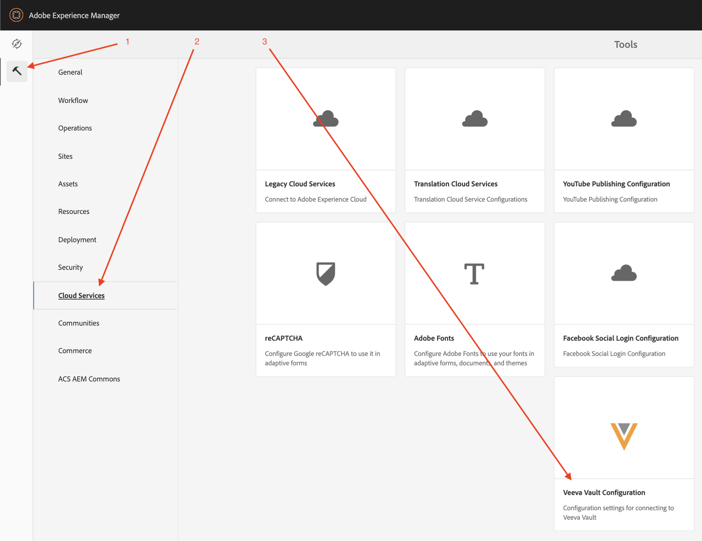
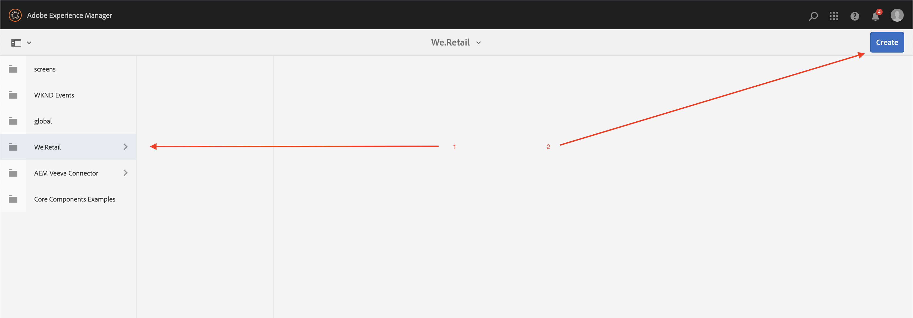
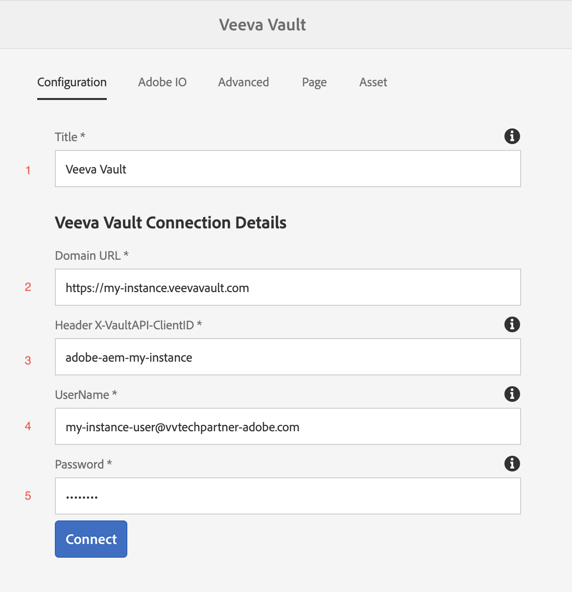
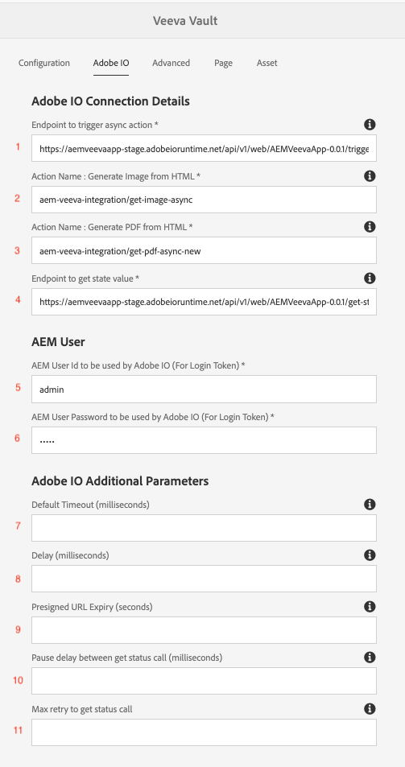
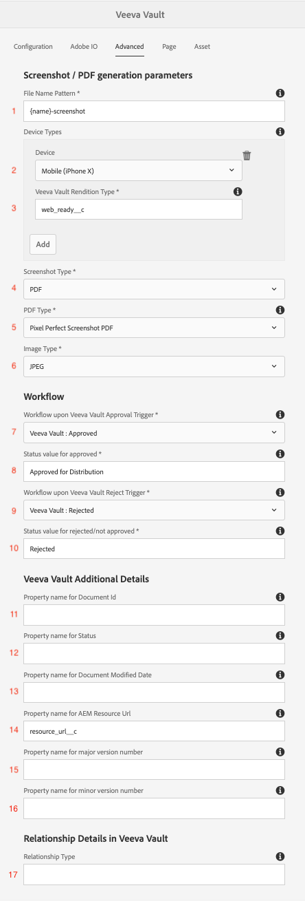
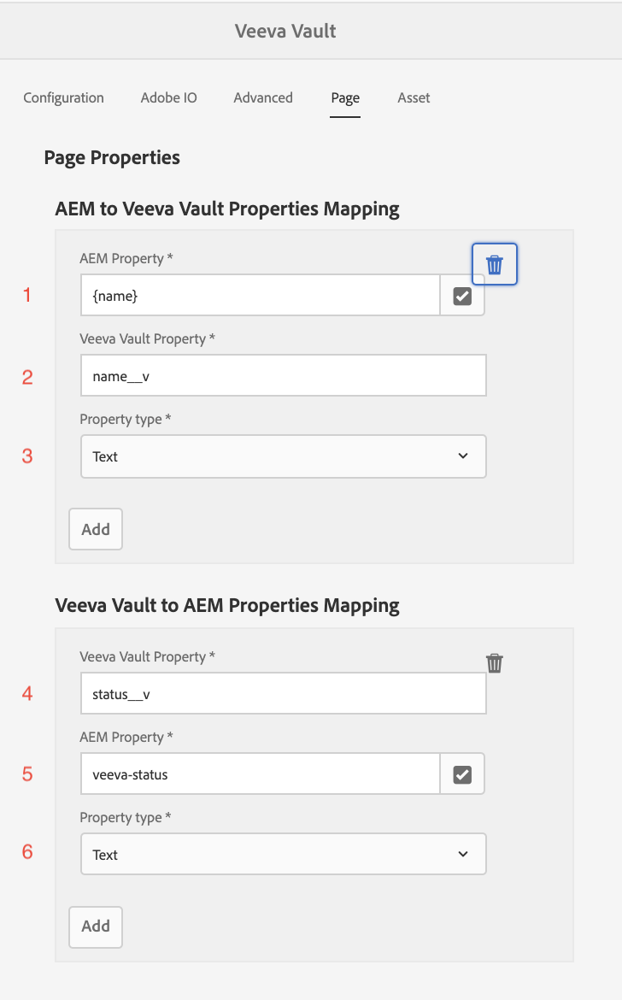
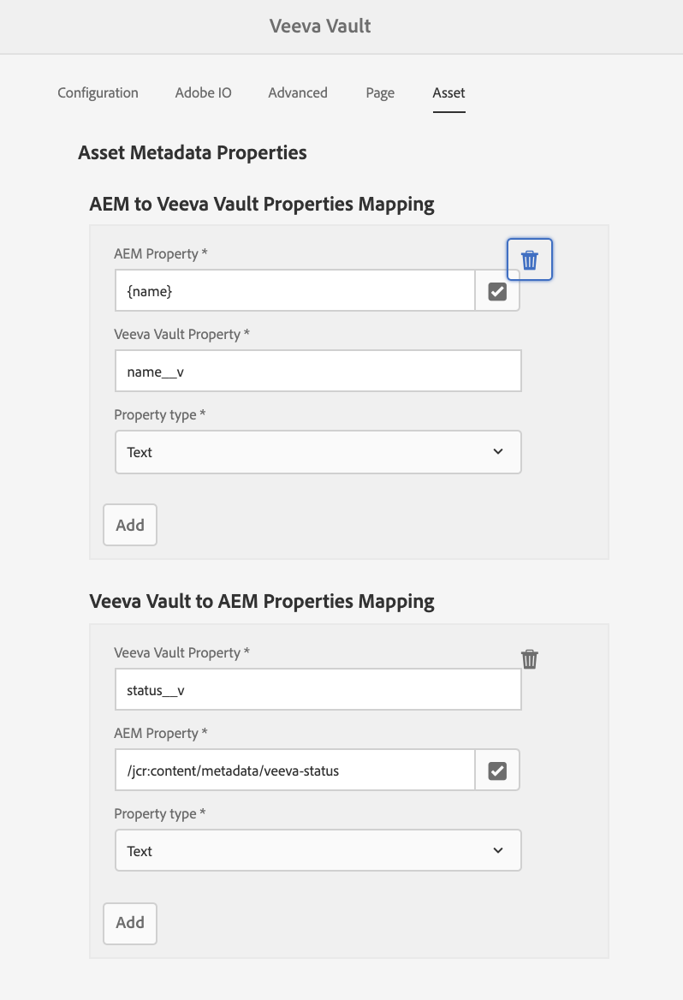
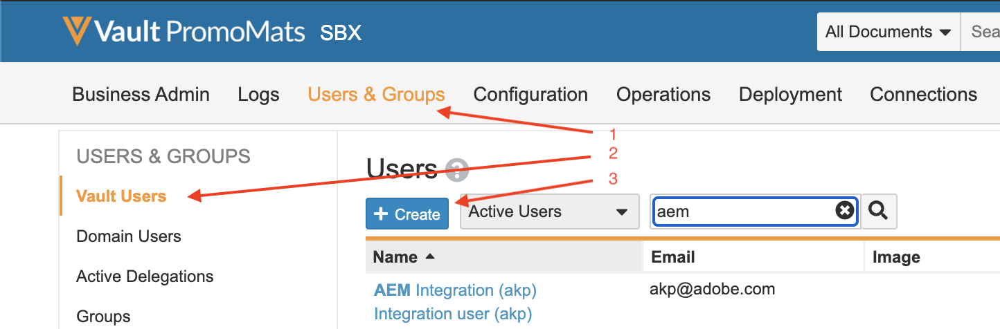
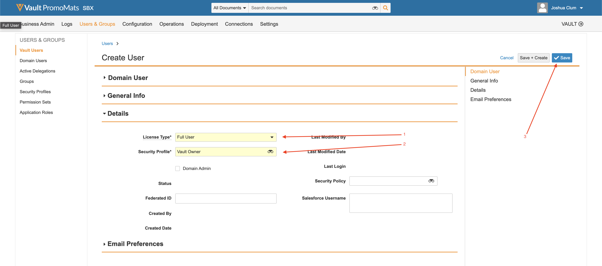

# Utilisation de l’intégration

## Présentation

La présentation vidéo suivante décrit l’utilisation du connecteur :

>[!VIDEO](https://video.tv.adobe.com/v/332137/?quality=12&learn=on)

## Configuration

Ce guide vous guidera tout au long de la mise en service du connecteur.

>[!IMPORTANT]
>
>Pour chaque système, ces étapes doivent être exécutées par un **administrateur**.
>
>Les étapes de cette documentation vous guideront tout au long de la création des intégrations/inscriptions impliquant l&#39;attribution d&#39;autorisations et/ou d&#39;accès administrateur.  Il est de votre responsabilité de vous assurer que ces étapes sont conformes aux politiques de votre entreprise avant de les exécuter, et de les exécuter avec précaution.
>

### Installer le package d’intégration

Vous recevrez l’accès au package AEM d’intégration. Il existe deux options pour installer l’intégration :

1. **Installation du package** - Simple et moins impliqué.
2. **Installation POM** - Plus avancée, mais peut s’avérer utile lors de l’utilisation d’AEM Cloud Manager et de la mise à niveau de l’intégration.

#### Installation du package

Pour installer le package, téléchargez-le avec le lien fourni dans l’e-mail d’intégration. [Vous trouverez des instructions détaillées pour installer un package AEM en cliquant ici.](https://experienceleague.adobe.com/docs/experience-manager-64/administering/contentmanagement/package-manager.html?lang=fr&#installing-packages)

#### Installation POM

Pour inclure le connecteur dans votre fichier POM, procédez comme suit. Remplacez vos nom d’utilisateur et mot de passe par ceux reçus dans l’e-mail d’intégration.

1. Ajoutez les éléments suivants au fichier `.cloudmanager/maven/settings.xml` dans votre projet ou `~/.m2/settings.xml` sur votre ordinateur. Remplacez `YOUR_USERNAME` par le nom d’utilisateur et `YOUR_PASSWORD` par le mot de passe fourni dans l’e-mail d’intégration.

   >[!IMPORTANT]
   >
   >Si vous utilisez Cloud Manager, l’approche sécurisée consiste à suivre les étapes décrites ici pour les [référentiels Maven protégés par mot de passe](https://experienceleague.adobe.com/docs/experience-manager-cloud-service/onboarding/getting-access/create-application-project/setting-up-project.html?lang=fr#password-protected-maven-repositories).

   ```
   <settings>
       ...
       <servers>
           ...
           <server>
               <id>repo.ea.adobe.net</id>
               <username>YOUR_USERNAME</username>
               <password>YOUR_PASSWORD</password>
               <filePermissions>BucketOwnerFullControl</filePermissions>
               <configuration>
                 <wagonProvider>s3</wagonProvider>
               </configuration>
           </server>
           ...
       </servers>
       ...
   </settings>
   ```

2. Ajoutez les éléments suivants au fichier `pom.xml` du projet :

   ```
   <project>
       ...
       <build>
           ...
           <extensions>
               ...
               <extension>
                   <groupId>com.allogy.maven.wagon</groupId>
                   <artifactId>maven-s3-wagon</artifactId>
                   <version>1.2.0</version>
               </extension>
               ...
           </extensions>
           ...
       </build>
       ...
       <repositories>
           ...
           <repository>
               <id>repo.ea.adobe.net</id>
               <url>s3://repo.ea.adobe.net/release</url>
               <releases>
                   <enabled>true</enabled>
               </releases>
           </repository>
           ...
       </repositories>
       ...
   </project>
   ```

3. Ajoutez les éléments suivants au fichier `all/pom.xml` du projet. Remplacez `project.dependencies.dependency.version` par la version appropriée et `project.build.plugins.plugin.configuration.embeddeds.embedded.target` par le chemin d’accès approprié.

   ```
   <project>
       ...
       <build>
           ...
           <plugins>
               ...
               <plugin>
                   <groupId>org.apache.jackrabbit</groupId>
                   <artifactId>filevault-package-maven-plugin</artifactId>
                   ...
                   <configuration>
                       ...
                       <embeddeds>
                           ...
                           <embedded>
                               <groupId>com.adobe.acs.aemveeva</groupId>
                               <artifactId>aem-veeva-connector.all</artifactId>
                               <type>zip</type>
                               <target>/apps/APP_NAME-packages/application/install</target>
                           </embedded>
                           ...
                       </embeddeds>
                   </configuration>
               </plugin>
               ...
           </plugins>
           ...
       </build>
       ...
       <dependencies>
           ...
           <dependency>
               <groupId>com.adobe.acs.aemveeva</groupId>
               <artifactId>aem-veeva-connector.all</artifactId>
               <version>1.0.5</version>
               <type>zip</type>
           </dependency>            
           ...
       </dependencies>
       ...
   </project>
   ```

### Configuration du cloud

Cette intégration est configurée en créant une configuration cloud sur le dossier sur lequel le connecteur fonctionnera. Pour créer une configuration cloud , procédez comme suit :

1. Accédez à la configuration cloud Veeva.

   

2. Créez une nouvelle configuration de cloud Veeva sur le dossier approprié et renseignez le fichier comme décrit dans les sections suivantes.

   

#### Onglet Configuration

Renseignez les champs suivants dans l’onglet Configuration :



1. Obligatoire. Titre de la configuration du connecteur Veeva Vault. Il peut s’agir d’une valeur arbitraire. (par ex. `Veeva Vault Configuration`)
2. Obligatoire. L’URL du domaine de l’instance Veeva (par exemple, `https://my-instance.veevavault.com/`)
3. Obligatoire. ClientID requis pour appeler l’API Veeva Vault. Il peut s’agir d’une valeur arbitraire qui est principalement utilisée à des fins de débogage. (par ex. `adobe-aem-vvtechpartner`)
4. Obligatoire. Nom d&#39;utilisateur Veeva Vault. Voir [Création d’utilisateurs Veeva](#veeva-user-creation).
5. Obligatoire. Mot de passe Veeva Vault. Voir [Création d’utilisateurs Veeva](#veeva-user-creation).

#### Onglet Adobe IO

Si le projet doit générer des fichiers PDF ou des images pour les pages, cet onglet est obligatoire. Renseignez les champs suivants dans l’onglet Adobe Io :



1. Obligatoire. Point d’entrée Adobe IO pour la création d’images PDF fourni dans l’e-mail d’intégration. (par ex. `https://my-namespace.adobeioruntime.net/api/v1/web/aem-veeva-serverless-0.0.2/trigger-action.json`)
2. Obligatoire. Nom d’action pour la génération d’images de page. Cette valeur doit être `aem-veeva-integration/get-image-async`.
3. Obligatoire. Nom d’action pour la génération d’images HTML. Cette valeur doit être `aem-veeva-integration/get-pdf-async-new`.
4. Obligatoire. Le point d’entrée Adobe IO pour obtenir l’état de la génération fournie dans l’e-mail d’intégration.(par ex. `https://my-namespace.adobeioruntime.net/api/v1/web/aem-veeva-serverless-0.0.2/get-state-value`)
5. Obligatoire. Nom d’utilisateur AEM à utiliser par Adobe IO. Voir [Création d’utilisateurs AEM](#aem-user-creation).
6. Obligatoire. Mot de passe AEM à utiliser par Adobe IO. Voir [Création d’utilisateurs AEM](#aem-user-creation).
7. Facultatif. Le délai d’expiration par défaut consiste à laisser la page répondre jusqu’à un moment spécifié, après quoi le service AIO cesse d’essayer d’obtenir une réponse. La valeur par défaut est `30000`.
8. Facultatif. Le délai est défini après que la page a répondu avec un délai de 200 pour que toutes les images s’affichent avant de prendre une capture d’écran. La valeur par défaut est `2000`.
9. Facultatif. L’URL générée pour la capture d’écran/PDF expirera après la valeur configurée en secondes.
10. Facultatif. Le service de génération de capture d’écran/PDF Adobe IO est asynchrone. Le service AEM appelle le point d’entrée d’état AIO pour obtenir une capture d’écran/PDF. Cette propriété détermine en millisecondes la pause entre dans chaque appel de statut. La valeur par défaut est `10000`.
11. Facultatif. Nombre maximal de reprises pour l’appel de statut à l’IO Adobe pour obtenir une capture d’écran/PDF. La valeur par défaut est `10`.

#### Onglet Avancé

Renseignez les champs suivants dans l’onglet avancé :



1. Obligatoire pour la génération du PDF/de l’image. Modèle de nom de fichier utilisé lors de la création de PDF/images. `{name}` peut être modélisé. (par ex. `{name}-screenshot`)
2. Facultatif. Types d’appareils pour lesquels des captures d’écran de page sont requises, autres que Desktop. Les types valides comprennent `Tab (iPad)` et `Mobile (iPhone X)`.
3. Facultatif. Valeur de type de rendu dans Veeva représentant le rendu ci-dessus. (par ex. `web_ready__c`)
4. Obligatoire pour la génération du PDF/de l’image. Type de capture d’écran à créer. `PDF` ou `Image`.
5. Obligatoire pour la génération du PDF/de l’image. Type de PDF à générer. `Print CSS Based PDF` ou `Pixel Perfect Screenshot PDF`.
6. Obligatoire pour la génération du PDF/de l’image. Type d’image à générer. `PNG` ou `JPEG`.
7. Obligatoire. Workflow à exécuter une fois que le déclencheur d’approbation Veeva Vault est arrivé.
8. Obligatoire. Valeur de propriété de statut représentant Approuvé. (par ex. `Approved for Distribution`)
9. Obligatoire. Workflow à exécuter une fois que le déclencheur de rejet de Veeva Vault est arrivé.
10. Obligatoire. Valeur de propriété de statut représentant Rejeté/Non approuvé. (par ex. `Rejected`)
11. Facultatif. Nom de propriété pour ID de document dans Veeva Vault. La valeur par défaut est `id`.
12. Facultatif. Nom de la propriété pour le statut dans Veeva Vault. La valeur par défaut est `status__v`.
13. Facultatif. Nom de la propriété pour la date de modification du document. La valeur par défaut est `version_modified_date__v`.
14. Facultatif. Nom de propriété de l&#39;URL de la ressource de document. La valeur par défaut sera `external_id__v`. Si ce champ est déjà utilisé, créez un autre champ dans Veeva et renseignez le nom du champ ici. Ce champ sera utilisé dans Veeva pour contenir le chemin de la ressource AEM. Cela est nécessaire pour la synchronisation automatisée des métadonnées.
15. Facultatif. Nom de propriété du numéro de version majeur dans Veeva Vault. La valeur par défaut est `major_version_number__v`.
16. Facultatif. Nom de propriété du numéro de version mineur dans Veeva Vault. La valeur par défaut est `minor_version_number__v`.
17. Facultatif. Valeur de type de relation Veeva Vault. Toutes les ressources ajoutées à la page seront représentées comme liées en fonction de cette valeur. La valeur par défaut est `supporting_document__c`.

#### Onglet Page

Si vous synchronisez des pages, remplissez les champs suivants dans l’onglet de page :



1. Obligatoire. Mappez une propriété d’AEM à Veeva.
a. Nom de la propriété AEM. Sélectionnable à partir des propriétés AEM. (par exemple, `jcr:title`) Les `{name}` peuvent être modélisées.
b. Le nom de propriété Veeva entré exactement à existe dans Veeva. (par ex. `name__v`)\
   c. Type de propriété. `Text` ou `Multiline Text`.

2. Obligatoire. Mappez une propriété de Veeva à AEM.
a. Le nom de propriété Veeva entré exactement à existe dans Veeva. (par ex. `name__v`)
b. Nom de la propriété AEM. Sélectionnable à partir des propriétés AEM. (par ex. `jcr:title`)
c. Type de propriété. `Text` ou `Multiline Text`.


#### Onglet Contenu

Si vous synchronisez des ressources, remplissez les champs suivants dans l’onglet Ressource :



1. Obligatoire. Mappez une propriété d’AEM à Veeva.
a. Nom de la propriété AEM. Sélectionnable à partir des propriétés AEM. (par exemple, `/jcr:content/metadata/jcr:title`) Les `{name}` peuvent être modélisées.
b. Le nom de propriété Veeva entré exactement à existe dans Veeva. (par ex. `name__v`)
c. Type de propriété. `Text` ou `Multiline Text`.

2. Obligatoire. Mappez une propriété de Veeva à AEM.
a. Le nom de propriété Veeva entré exactement à existe dans Veeva. (par ex. `name__v`)
b. Nom de la propriété AEM. Sélectionnable à partir des propriétés AEM. (par ex. `/jcr:content/metadata/jcr:title`)
c. Type de propriété. `Text` ou `Multiline Text`.

### Configuration supplémentaire

#### Création d’un utilisateur AEM

Lors de la génération du PDF/de l’image, un utilisateur AEM doit être créé pour obtenir des pages d’AEM. Créez et accordez des autorisations en lecture seule à un utilisateur en suivant ces liens :

Si vous utilisez AEM version 6.5.5 ou ultérieure :

* [Création d’un utilisateur dans AEM](https://experienceleague.adobe.com/docs/experience-manager-65/forms/administrator-help/setup-organize-users/adding-configuring-users.html?lang=fr&#create-a-user)
* [Ajout d’autorisations à un utilisateur dans AEM](https://experienceleague.adobe.com/docs/experience-manager-65/administering/security/security.html?lang=fr&#permissions-in-aem)

Si vous utilisez les services cloud AEM :

* [Gestion des utilisateurs avec AEM Cloud Services](https://experienceleague.adobe.com/docs/experience-manager-learn/cloud-service/accessing/aem-users-groups-and-permissions.html?lang=fr&#accessing)

Les autorisations suivantes sont requises pour l’utilisateur du service AEM sur le contenu qui sera converti en PDF/Image et envoyé à Veeva :

* Lecture

>[!IMPORTANT]
>
> Ces actions doivent être effectuées en tant qu’administrateur pour chaque système.
> Vous devez respecter les normes de sécurité de votre entreprise lors de la création d’utilisateurs et de la définition des autorisations.

#### Veeva User Creation

Pour utiliser cette intégration, un utilisateur doit être créé dans Veeva Vault. Pour créer un utilisateur, procédez comme suit :

1. Accédez à Admin -> Utilisateurs et groupes -> Utilisateurs Vault -> Créer

   

1. Renseignez les entrées requises. La configuration la plus simple consiste à définir le `License Type` sur `Full User` et le `Security Profile` sur `Vault Owner`. Enregistrer une fois l’opération terminée.

   

Les autorisations suivantes sont requises pour les types de documents Veeva spécifiques utilisés :

* Créer/lire des documents
* Créer/Lire des versions
* Création/mise à jour de métadonnées
* Création/mise à jour de rendus

>[!IMPORTANT]
>
> Ces actions doivent être effectuées en tant qu’administrateur pour chaque système.
> Vous devez respecter les normes de sécurité de votre entreprise lors de la création d’utilisateurs et de la définition des autorisations.
